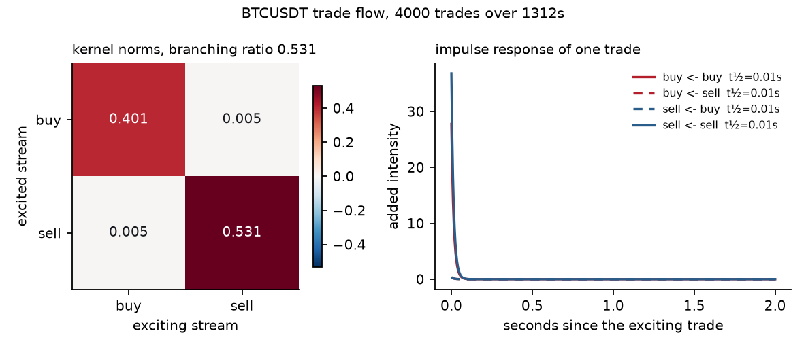

# HawkesDiffusion

[](https://github.com/Leo-Y-Zhang/HawkesDiffusion/actions/workflows/ci.yml)


A Hawkes process is a point process that excites itself: every event raises the
chance of the next, and the effect decays. With two streams it also
cross-excites, so you can ask how hard a shock in one stream hits the other and
how long the reaction lasts.

```
λ_i(t) = μ_i + Σ_j Σ_{t_k^j < t} α_ij · exp(−β_ij (t − t_k^j))
```

Two quantities carry the meaning. The **half-life** ln2/β is how fast the
reaction to one event decays. The **branching ratio** — the spectral radius of
[α_ij/β_ij] — is the share of activity that is the market reacting to itself
rather than to outside information.

## What it found

Fitted to 4,000 live Binance BTCUSDT trades over 1,312 seconds
(2,284 buyer-initiated, 1,716 seller-initiated), on 2026-08-30.

### The single-exponential model fails, and fails informatively

With one exponential kernel the likelihood rises monotonically as the kernel
gets faster, with **no interior optimum** — the signature of a process with no
single characteristic timescale. Worse, the headline number is not identified:

| kernel | branching ratio across grid choices | verdict |
|---|---|---|
| single exponential | **0.531 to 0.928** | not identified — the answer is whatever half-life you assumed |
| multi-exponential | **0.572 to 0.605** | stable across a 25× range of grids |

An endogeneity figure quoted without its kernel is a choice, not a measurement.

### The fix: a power law, approximated by a sum of exponentials

A true power-law kernel costs O(n²) because it has no recursive form. Following
the market-microstructure literature, it is approximated by 10
exponentials with geometrically spaced decay rates, which keeps the O(n)
recursion at one state per component.

| | log-likelihood | branching ratio | KS statistic (buy) |
|---|---|---|---|
| Poisson benchmark | -2,273.3 | — | — |
| single exponential | 5,225.9 | 0.5311 | 0.2252 |
| **multi-exponential** | **6,759.4** | **0.5716** | **0.1467** |

That is **+1,533.5** log-likelihood for the richer kernel, and the
branching ratio becomes a measurement rather than an assumption.

The fit is also 90× faster, for a reason worth recording: the recursive state
depends only on the decay rates, never on the weights, so every state is
computed once and the likelihood becomes linear-in-weights inside a log —
concave, with an exact gradient.

⚠ **The first attempt at this was slower *and worse* than the model it
contains as a special case.** Decay rates span four orders of magnitude, so raw
amplitudes do too, and L-BFGS-B stalled. Reparameterising to kernel *norms*
(a/β — all branching contributions, all the same scale) fixed the conditioning.
A more flexible model scoring worse than its own special case is always a
numerical bug, never a modelling result.

### It is still rejected, and the reason is the data, not the kernel

The rescaled residuals still fail the Kolmogorov–Smirnov test
(0.1467, p = 2.5e-43). Pushing the grid faster keeps improving the fit —
but **1,367 of 4,000 trades share a millisecond**, and ties were
broken by uniform jitter within that millisecond. Any gain from a kernel faster
than ~1 ms is therefore fitting **that jitter**, not the market.

So the grid deliberately stops at a 0.002 s half-life. Beyond that point
the limit is the timestamp resolution, and no kernel can repair it — that needs
microsecond data.



## Why the fitter is trustworthy anyway

A rejection is only worth reading if the machinery works. It is checked by
simulating processes whose parameters are known exactly and requiring them back:

- **Parameter recovery** — simulate 4,000 seconds of a self-exciting process
  with μ=0.5, α=0.9, β=2.0 via Ogata thinning, fit it, and require μ, α, β and
  the branching ratio back within tolerance.
- **Analytic likelihood** — with α=0 the process is Poisson, whose
  log-likelihood is `n·log μ − μT` in closed form; the general code must match
  it exactly.
- **The residual test in both directions** — it must *fail to reject* a
  correctly specified Poisson process, and must decisively reject one fitted
  with the wrong rate. A goodness-of-fit test that never fires proves nothing.
- **The O(n) recursion** — the recursive intensity state is checked against the
  direct O(n²) double sum to 1e-10.

## Two bugs worth recording

**Tie-breaking invented the answer.** Binance timestamps are millisecond
resolution and many trades share one. A point process cannot have simultaneous
events, so the first version nudged duplicates a fixed microsecond apart. The
fitter then found enormous excitation on a microsecond timescale — it was
measuring the tie-breaking rule. The timestamps are interval-censored, so the
right treatment is uniform jitter *within* the known millisecond. That moved the
residual KS p-value from 1e-32 to 1e-3.

**Fitting all ten parameters at once is ill-conditioned.** Free β runs away
chasing sub-millisecond bursts and the cross-excitation terms collapse to
exactly zero. Holding β fixed and scanning a grid of timescales leaves six
well-behaved parameters and turns the awkward dimension into a visible model
choice, which is what produced the table above.

## Running it

Requires `numpy` and `scipy`.

```
pip install -e .

hawkesdiffusion fit           # both kernels on real trade flow
hawkesdiffusion recover       # simulate known parameters and fit them back
hawkesdiffusion residuals     # time-rescaling goodness of fit
hawkesdiffusion verify        # offline suite
```

## A note on the streams

The brief for this was macro news against price moves. No free feed publishes
news at the millisecond resolution the model needs, so the two streams here are
buyer-initiated and seller-initiated trades in the same instrument — the
canonical Hawkes application, and the mathematics is identical. `hawkes.py`
takes any pair of event-time arrays.

## Layout

| file | purpose |
|---|---|
| `src/hawkesdiffusion/hawkes.py` | likelihood, MLE, timescale scan, simulation, residuals |
| `src/hawkesdiffusion/multiexp.py` | multi-exponential kernel, precomputed design, exact gradient |
| `src/hawkesdiffusion/binance.py` | real trade event times, tie handling, caching |
| `src/hawkesdiffusion/analysis.py` | both kernels compared; writes `results_multi.json` |
| `src/hawkesdiffusion/__main__.py` | CLI |
| `scripts/check_spdx.py` | one-line licence header check, enforced in CI |
| `make_readme.py` | renders this file from `results.json` |

Every number above is injected from `results.json` and `results_multi.json`;
the generator fails if one is missing.

## Scope

This reads public, unauthenticated market data and fits a statistical model to
it. It holds no credentials, connects to no account, and places no orders — the
only network call is a read-only GET for historical trades. Nothing here is
investment advice, and the headline model is reported as **rejected**, so no
result in this repository should be relied on to predict anything.

## Reference

Rambaldi, Pennesi & Lillo, *Modeling FX market activity around macroeconomic
news: a Hawkes process approach*. Bacry, Mastromatteo & Muzy, *Hawkes processes
in finance*, on why power-law kernels are used for trade flow.
